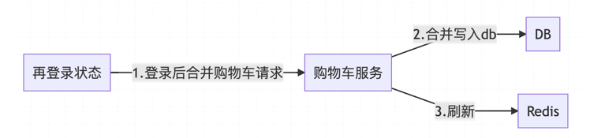

# 高并发编程解决方案

### 1.SpringBoot+Redis+lua 实现黑客防刷攻击、短信验证等；

### 2.高并发的京东购物车技术实现
##### 1）登录状态下添加商品到购物车

>在高并发的情况下，登录用户添加购物车，购物车服务先把数据存储在redis，然后发消息给消息中间件，最后消费中间件的数据写入数据库。
这种高并发情况，就能保证所有的查询操作都能落在reids上，从而使数据平稳持久化到db。
##### 2）未登录状态下添加商品到购物车

>未登录用户添加购物车，购物车服务为该用户生成唯一id: cartId，并把该cartId作为key，把购物车的数据保存进redis(有效期3个月),最后购物车服务把该cartId回写进用户的cookies
这个环节不保存数据库了，因为没有对应的用户。以后用户每次添加商品都带上这个cartId就行。
##### 3）再登录状态合并

>用户登录成功后，客户端把cookies里面的cartId和userId发给购物车系统，购物车系统通过cartId把redis未登录的数据合并插入到该userId的数据库里面。
最后重新刷新添加到登录userId的redis数据,删除未登录carId的redis数据。

    

# concurrent-demo
